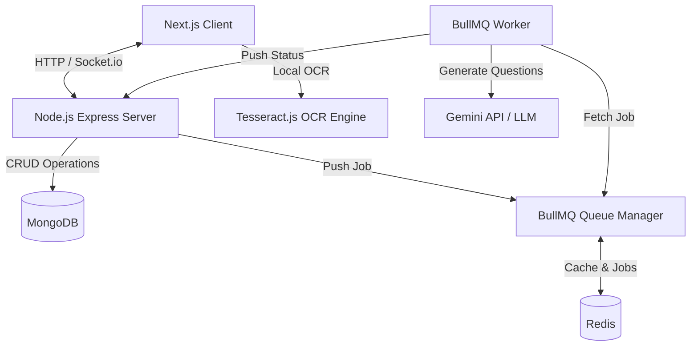

# 🎓 VedaAI: AI Assessment Creator

VedaAI is a modern, full-stack AI Assessment Creator application that enables educators to construct custom question papers and assessments rapidly. Users can upload reference documents (PDFs, text files, or images using client-side OCR), configure question types, specify quantities and marks, and receive formatted, beautifully styled question sheets with difficulty badges. The platform features real-time generation updates, responsive layouts, export options, and a premium light/dark mode design.

---

## 🏗️ Architecture Overview

The system is split into a decoupled **Frontend (Next.js)** and **Backend (Express.js)**, using standard databases and queue microservices for background generation.



### 1. Frontend Architecture (Next.js)
* **Framework**: React / Next.js with App Router.
* **State Management**: **Zustand** store (`useAssignmentStore`) managing global state for assignments list, selected assessment, creation progress, theme states, and real-time generation states.
* **Client-Side OCR**: Local image scanning via **Tesseract.js**. This processes JPG and PNG files directly in the browser, extracting syllabus/reference text and injecting it into the prompt payload without server-side compute overhead.
* **Styling**: Structured vanilla CSS in `globals.css` with a CSS custom-properties (variables) system for light and dark modes. Responsive grids and flex layouts ensure exact scaling down to mobile viewports.
* **Real-time Engine**: **Socket.io-client** listening to background progress and streaming logs directly into the generation loader.

### 2. Backend Architecture (Node.js & Express)
* **Framework**: Node.js, Express, TypeScript.
* **Database**: **MongoDB (Mongoose)** storing assignments, paper schemas, answer keys, metadata, and status logs.
* **Caching & Queue Manager**: **Redis** serving as the cache layer and message broker for **BullMQ**.
* **Worker Services**: **BullMQ Worker** process running in a decoupled container thread (`generationWorker.ts`). It handles Gemini AI structured prompt assembly, processes responses, and updates the database record. 
* *Robust Fallback*: Includes an event-driven internal memory queue fallback that kicks in automatically if Redis is unavailable, ensuring high reliability for development environments.
* **PDF Exporter**: **pdfkit** running synchronously to generate high-fidelity print-ready PDFs of the generated question paper.

---

## 🎨 Approach & Design Aesthetics

The application layout has been built to match the Figma designs:
* **Floating Panel Canvas**: The workspace uses a light grey background (`#EAECEF` / `--bg-workspace`) containing floating white cards with clean margins and `20px` rounded corners.
* **Custom SVG Iconography**: All sidebar navigation items (Home, Groups, Assignments, Library, Toolkit) use custom SVGs rather than stock library icons, capturing the visual weight and styling of the mockups.
* **Header Breadcrumbs & Navigation**: Features a floating pill-shaped capsule with rounded ends containing a back button, active page labels, a search bar, a dark/light mode toggle, and the profile card containing a Bored Ape avatar.
* **Pill-shaped Numeric Selectors**: Quantity and marks selectors in the creation form are pill-shaped, using subtle dark borders, grey controls (`+` and `-`), and bold values.
* **Dynamic Columns**: Layout tables and dropdown question configs align vertically using a CSS grid template (`grid-template-columns: 300px 110px 110px 40px`).
* **Auto-generated Assignment Titles**: The form omits a manual title field to prevent UI clutter. It automatically generates context-aware titles on submission using the source filename or timestamp.
* **Dark Mode System**: A complete custom variable mapping loaded via standard `data-theme="dark"` attribute injection. The background changes to `#121214` and cards darken to `#1E1E22` with corresponding text color flips.

---

## ⚙️ Setup & Installation

### Prerequisites
* **Node.js** (v18 or higher)
* **MongoDB** (Running instance or MongoDB Atlas Connection String)
* **Redis** (Optional: local redis server running on `port 6379`. If offline, the backend automatically fails over to the memory queue module)

---

### 1. Environment Configurations

#### Backend Setup (`backend/.env`)
Create a `.env` file inside the `backend` directory:
```env
PORT=5000
MONGODB_URI=mongodb://localhost:27017/veda-ai
REDIS_URL=redis://localhost:6379
GEMINI_API_KEY=your_gemini_api_key_here
```

#### Frontend Setup (`frontend/.env.local` - Optional)
Create a `.env.local` file inside the `frontend` directory if customizing the backend port:
```env
NEXT_PUBLIC_API_URL=http://localhost:5000
```

---

### 2. Getting Started

#### Backend Installation & Launch
```bash
# Navigate to backend
cd backend

# Install dependencies
npm install

# Run backend development server (starts on http://localhost:5000)
npm run dev
```

#### Frontend Installation & Launch
```bash
# Navigate to frontend
cd frontend

# Install dependencies
npm install

# Run frontend development server (starts on http://localhost:3000)
npm run dev
```

Open [http://localhost:3000](http://localhost:3000) in your browser to view the application.

---

## 🛠️ Verification Checklist

Below is the verification coverage status of the codebase:

- [x] **Client-Side OCR**: Correctly processes uploaded images using local `Tesseract.js` worker and feeds the text into the assessment context.
- [x] **No negative/empty selector values**: The state managers and input handlers prevent negative quantities and default values cleanly.
- [x] **Websocket Management**: Open connections are properly tracked, subscribing to progress events during creation and cleaning up on layout unmounts.
- [x] **Structured AI Generation**: Questions are split into sections (Section A, Section B), with clear marks and difficulty levels (`[Easy]`, `[Medium]`, `[Hard]`) dynamically printed.
- [x] **BullMQ Background processing**: Generation runs asynchronously inside a background worker queue with progress status updates.
- [x] **Light/Dark Mode Toggle**: Real-time styling switch using CSS variables.
- [x] **PDF Exporter**: Outputs printable PDF documents with clean layout margins.
- [x] **Regenerate Handler**: Action button in the output banner triggers backend regeneration from the source instructions.
- [x] **Responsive Mobile Layout**: Collapses main columns, implements hamburger navigation, and shows a bottom navigation tab bar with a floating action button on mobile screens.
